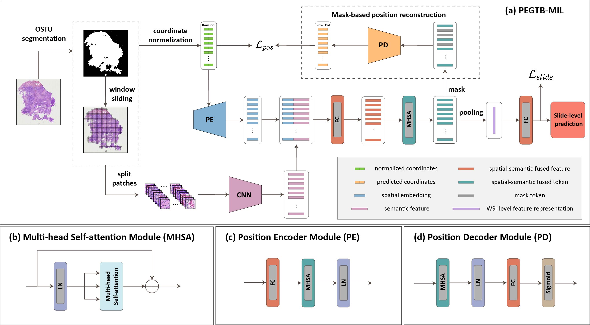

# PEGTB-MIL
## Title: Positional Encoding-Guided Transformer-Based Multiple Instance Learning for Histopathology Whole Slide Images Classification

[//]: # (## Abstract)

[//]: # ()
[//]: # (### Background and objectives:)

[//]: # (Whole slide image &#40;WSI&#41; classification is of great clinical significance in computer-aided pathological diagnosis. Due to the high cost of manual annotation, weakly supervised WSI classification methods have gained more attention. As the most representative, multiple instance learning &#40;MIL&#41; generally aggregates the predictions or features of the patches within a WSI to achieve the slide-level classification under the weak supervision of WSI labels. However, most existing MIL methods ignore spatial position relationships of the patches, which is likely to strengthen the discriminative ability of WSI-level features.)

[//]: # ()
[//]: # (### Methods:)

[//]: # (In this paper, we propose a novel positional encoding-guided transformer-based multiple instance learning &#40;PEGTB-MIL&#41; method for histopathology WSI classification. It aims to encode the spatial positional property of the patch into its corresponding semantic features and explore the potential correlation among the patches for improving the WSI classification performance. Concretely, the deep features of the patches in WSI are first extracted and simultaneously a position encoder is used to encode the spatial 2D positional information of the patches into the spatial-aware features. After incorporating the semantic features and spatial embeddings, multi-head self-attention &#40;MHSA&#41; is applied to explore the contextual and spatial dependencies of the fused features. Particularly, we introduce an auxiliary reconstruction task to enhance the spatial-semantic consistency and generalization ability of features.)

[//]: # ()
[//]: # (### Results:)

[//]: # (The proposed method is evaluated on two public benchmark TCGA datasets &#40;TCGA-LUNG and TCGA-BRCA&#41; and two in-house clinical datasets &#40;USTC-EGFR and USTC-GIST&#41;. Experimental results validate it is effective in the tasks of cancer subtyping and gene mutation status prediction. In the test stage, the proposed PEGTB-MIL outperforms the other state-of-the-art methods and respectively achieves 97.13±0.34, 86.74±2.64, 83.25±1.65, and 72.52±1.63 of the area under the receiver operating characteristic &#40;ROC&#41; curve &#40;AUC&#41;.)

[//]: # ()
[//]: # (### Conclusions:)

[//]: # (PEGTB-MIL utilizes positional encoding to effectively guide and reinforce MIL, leading to enhanced performance on downstream WSI classification tasks. Specifically, the introduced auxiliary reconstruction module adeptly preserves the spatial-semantic consistency of patch features. More significantly, this study investigates the relationship between position information and disease diagnosis and presents a promising avenue for further research.)

## Authers:
Jun Shi, Dongdong Sun, Kun Wu, Zhiguo Jiang, Xue Kong, Wei Wang, Haibo Wu, and Yushan Zheng.


[Yushan Zheng](https://zhengyushan.github.io/) is the corresponding author.


E-mail: yszheng@buaa.edu.cn

## Framework:


## Installation:
### feature format:
```none
-feature_dir
  -slide-1_feature.pth
  -slide-1_coordinates.pth
  -slide-2_feature.pth
  -slide-2_coordinates.pth
  ......
  -slide-n_feature.pth
  -slide-n_coordinates.path
 
 xxx_feature.pth -> shape: number_patches, feaure_dim
 xxx_coordinates.pth -> shape: number_patches, 2(row, col)
```

### Environment:
1. python_version: 3.8
2. install 3rd library:
```shell
pip install -r requirements.txt
```


## 4. Run:
```shell
python main.py
```
